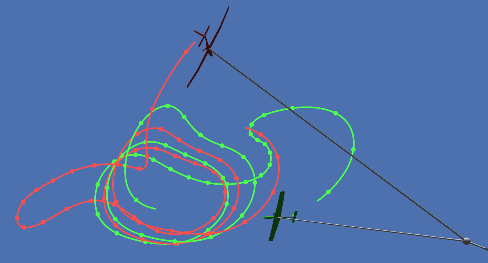

# Feasibility Analysis of a Dual-Aircraft Airborne Wind Energy System

Master's thesis code, Janis Maczijewski

## Demo Video

## Dependencies

* MATLAB 
    * Tested with Version 9.6.0.1135713 (R2019a) Update 3
    * Tested with Version 9.8.0.1417392 (R2020a) Update 4 (Warning: Model generation is slow due to an issue with `matlabFunction()`)
    * Symbolic Math Toolbox
* CasADi (casadi-windows-matlabR2016a-v3.5.1)

## Setup

Paths are examples, fix them for your setup!

### CasADi

* Download and unpack `casadi-windows-matlabR2016a-v3.5.1.zip` (https://github.com/casadi/casadi/releases/tag/3.5.1)
* Create environment variable `CASADI_v531=C:\Users\janis\casadi-windows-matlabR2016a-v3.5.1` (used in startup.m)
* Append `C:\Users\janis\casadi-windows-matlabR2016a-v3.5.1` to environment variable `PATH`

## Usage

See `main.m`